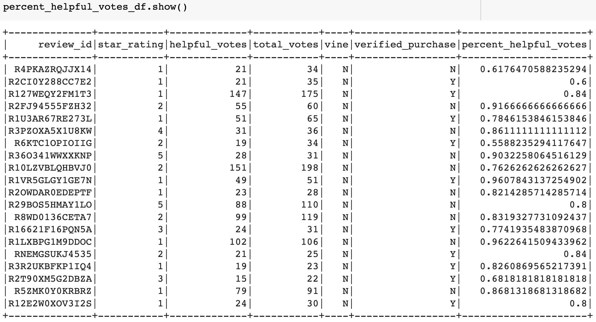
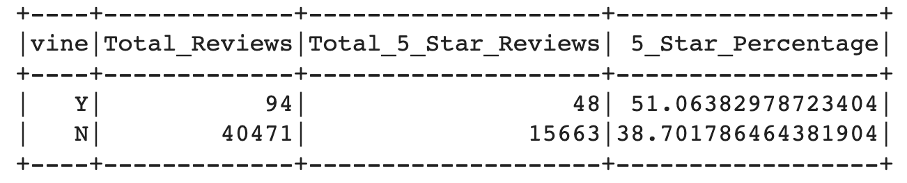

# Amazon_Vine_Analysis
Big Data using PySpark, Google Collab, Postgres, pgAdmin, AWS (RDS, S3 Buckets)

## Overview 
***Background***
The Amazon Vine program is a company that allows manufacturers and publishers to receive reviews for their products. Companies can pay a small fee to Amazon and provide products to Amazon Vine members so they will publish a review for their product. 

***Purpose***
The purpose of this challenge is to analyze if there is bias for Amazon reviews written by members of the paid Amazon Vine program by: 
- Using Pyspark for the ETL process by first extracting the dataset and transforming the data. 
- Connect to the AWS RDS Instance to load the transformed data into pgAdmin 
- Use PySpark, Pandas or SQL to determine if there is any bias toward favorable reviews from Vine Members in the dataset 
- Write a summary 

## Resources 
- Original Data Source: [Video Games Dataset from Amazon Review datasets](https://s3.amazonaws.com/amazon-reviews-pds/tsv/index.txt)
- Software: PySpark, Google Collab, Postgres, pgAdmin, AWS (RDS, S3 Buckets)

## Results
### ETL - Extract, Transform & Load
To perform ETL on Amazon Product Review on Video Games, we had to: 
1. Create a new database in Amazon RDS.
2. Create a new database in pgAdmin.
3. Extract the data into a new DataFrame in a notebook on Google Collab using Pyspark.
4. Transform the dataset that matches the schema in pgAdmin. 
5. Make the connection to AWS RDS.
6. Load the dataframes that correspond to the tables in pgAdmin
7. Run a query to check the tables are populated in pgAdmin. 

Click [here](https://github.com/meghanhkoon/Amazon_Vine_Analysis/blob/main/Amazon_Reviews_ETL.ipynb) to see our entire ETL process.

### Determine Bias of Vine Reviews 
After the ETL process, we then continued our [Vine Review Analysis](https://github.com/meghanhkoon/Amazon_Vine_Analysis/blob/main/Vine_Review_Analysis.ipynb). 

After filtering total_votes count to be equal or greater than 20 to pick reviews that are more likely to be helpful, we retrieved all the rows where helpful_votes divided by total_votes were equal or greater than 50%. 

We used this filtered dataset as the basis of reviewing Vine vs. Non-vine reviews. From this dataframe, we were able to find how many Vine reviews and non-Vine reviews there were for the Video Games Dataset, how many of them were 5 star reviews, and lastly the percentage of reviews were 5 stars. 

***VINE SUMMARY***

- Out of the total 40,565 reviews: 94 were Paid Vine Reviews (.2%) and 40,471 Non-Vine Reviews (99.8%). 

- Out of the 94 Total Vine reviews, 48 were 5 stars. From the 40,471 non-Vine reviews, 15,663 were 5 stars. 

- **51.06%** of Vine reviews were 5 stars. **38.7%** of non-Vine reviews were 5 stars. 

## Summary 
The extremely small sample size of Vine Reviews (.2%)  vs. Non-Vine Reviews (99.8%) from the Video Games dataset makes it hard to compare paid vs. non-paid reviews on Amazon. We see that 50.06% of Vine Reviews were 5 stars and 38.7% of non-Vine reviews were 5 stars. With more than a 10% difference, this demonstrates a positivity bias for reviews in the Vine program. 

For additional analysis, we would have to run the same analysis on the other datasets to see if there is a common trend. 
